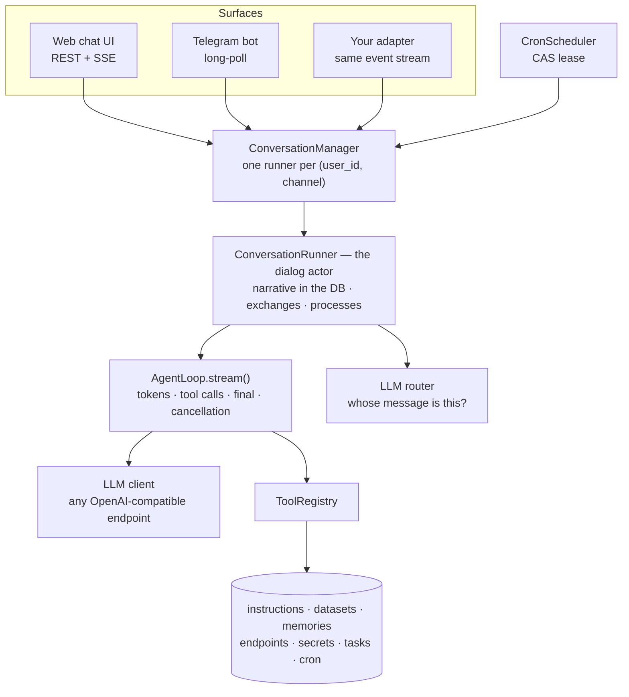

# OctoForge

**A self-hosted, multi-user agent platform for teams — with a typed Python core you can embed in your own stack.**

[](https://github.com/dmirain/OctoForge/actions/workflows/ci.yml)
[](LICENSE)


Give a whole team one assistant that knows your systems: it learns new skills, remembers per person,
calls your internal APIs with credentials it never gets to see, runs jobs on a schedule, and answers
several people — or several questions from one person — at the same time. Everything runs on your
hardware, against any OpenAI-compatible model endpoint.

The part that makes it *yours* is the core: `octoforge-core` is a plain, typed, `Protocol`-port
Python library with no web framework in sight. The web chat UI and the Telegram bot in this repo are
two adapters over it. Your intranet portal, your ticketing system or your own channel is a third one.

```bash
git clone https://github.com/dmirain/OctoForge && cd OctoForge
make quickstart      # generates .env (credentials included), starts Postgres + the app
```

---

## Contents

- [Try it](#try-it) · [What you get](#what-you-get) · [What is unusual about it](#what-is-unusual-about-it)
- [Why it feels fast](#why-it-feels-fast) · [The exchange model](#the-exchange-model)
- [Fitting it into your stack](#fitting-it-into-your-stack) · [Security posture](#security-posture)
- [Configuration](#configuration) · [Using it as a library](#using-it-as-a-library)
- [Documentation](#documentation) · [Development](#development)

## Try it

You need Docker and a key for any OpenAI-compatible endpoint (OpenAI, a local Ollama, your own
gateway). One command:

```bash
make quickstart
```

It writes `.env` with the two values nobody can guess — a generated operator password (printed once)
and a master key for the encrypted secret store — asks for your LLM endpoint, then brings up Postgres
and the app on `http://127.0.0.1:8000`. No domain, no TLS, no certificate. An existing `.env` is
checked, never overwritten.

The local overlay (`docker-compose.local.yml`) is deliberately harmless next to a real deployment
from the same checkout: its own compose project and Postgres volume, its own image tag, no published
database port, no Caddy, and Telegram stays off unless you set `OF_QUICKSTART_TELEGRAM_TOKEN`
(a bot can only be polled by one process — otherwise trying things out would steal a live bot's
updates). The image skips torch, so the first build takes minutes rather than tens of minutes.

Then:

| Where | What |
|---|---|
| `http://127.0.0.1:8000/` | streaming chat UI; the name field picks which dialog you are in |
| `http://127.0.0.1:8000/admin.html` | operator console: dialogs, exchanges, tasks, cron, knowledge, datasets, memories, users |
| `http://127.0.0.1:8000/docs` | OpenAPI schema of the whole HTTP surface |

Stop it with `make quickstart-down`; watch it with `make quickstart-logs`.

**Startup tells you what is actually on.** Optional capabilities are switched by configuration, so
the composition root reports the graph it built — and warns about the two gaps that would otherwise
bite you silently:

```
capabilities of this installation:
  llm                  on   gpt-4o-mini at api.openai.com
  embeddings           on   text-embedding-3-small at api.openai.com (inherited from OF_LLM_*)
  reranker             off  OF_RERANKER_MODEL is empty — recall ranks by cosine only
  vision               on   minimax-m3 at api.openai.com
  image_look tool      on   qwen3.5:397b
  voice messages       off  set OF_STT_BASE_URL and OF_STT_MODEL to transcribe recordings
  web search           off  OF_SERPER_TOKEN is empty — the web_search tool stays hidden
  secret store         on   Fernet, one-time links at http://127.0.0.1:8000
  database             on   postgresql
  operator credential  on   HTTP Basic as 'admin'
  telegram             off  OF_TELEGRAM_BOT_TOKEN is empty — the adapter does not start
```

Embeddings inherit `OF_LLM_BASE_URL`/`OF_LLM_API_KEY` unless you name an endpoint of their own: one
credential is enough for the agent's knowledge search to work, and a forgotten variable no longer
silently removes its most important tool.

**Development instead of Docker:** `make install` (creates `.venv`, includes the local
sentence-transformers backend), `cp .env.example .env`, then `make run` for autoreload.
**Telegram**, when you want to see the agent in a real messenger: put `OF_TELEGRAM_BOT_TOKEN` in
`.env` and it starts alongside the web app (in the quickstart stack, `OF_QUICKSTART_TELEGRAM_TOKEN`)
— or run `make run-telegram` for the bot alone, a process that opens no port at all. For a public
deployment, `docker compose up -d` adds Caddy, which obtains and renews a Let's Encrypt certificate
for `SITE_DOMAIN` on its own — the topology and day-2 operations are in
[docs/guides/deployment.md](docs/guides/deployment.md), and the longer walkthrough of this section is
[docs/guides/quickstart.md](docs/guides/quickstart.md).

## What you get

**The agent's toolbox** — every tool is a port implementation wired in the composition root, and
tools appear or disappear with configuration and with who is asking:

| Tool | What it does |
|---|---|
| `recall` | one ranked search over skills, knowledge, dataset descriptors and the user's memories, with no record type crowding out the others (endpoints stay out of the default results — ask for them with `type=endpoint`) |
| `instruction_save` / `instruction_delete` | writes a new skill or knowledge record — this is how the agent keeps what it learns — and removes its own |
| `endpoint_get` / `external_call` | resolves a stored endpoint's contract, then calls it: SSRF-guarded, with declarative secret auth |
| `http_request` | a plain outbound HTTP call, for what has no stored endpoint yet |
| `data_put` / `data_query` / `data_forget` | per-user datasets validated against a JSON schema |
| `memory_store` / `memory_delete` | per-user memory, searched together with everything else |
| `task_create` / `task_list` / `task_delete` | background work; pass a `schedule` and the same call creates a cron job |
| `cron_pause` / `cron_resume` | control a scheduled job |
| `history_search` | search the dialog's own past, including what compaction already summarized |
| `ask_user` | ask a clarifying question and park the obligation until the answer arrives |
| `web_search` | web search via serper.dev (only with `OF_SERPER_TOKEN`) |
| `image_look` | re-examine a picture the dialog received, with a stronger vision model |
| `admin_manage` | operator surface inside the chat: users, invites, cross-user search, publishing (admins only) |

**The surfaces** — a streaming web chat (REST + SSE), a Telegram bot (voice messages transcribed
into the user's own words, images described, albums kept whole, answers upgraded to native Rich
Messages when they contain tables or checklists), and an operator console with a cross-user read
model. All three sit on the same conversation engine and the same typed event stream.

**The operations** — Alembic migrations, Postgres or SQLite, health and readiness probes, a cron
scheduler safe to run on several instances (SQL compare-and-swap lease), an outbox that keeps a
result until someone is there to receive it, and recovery of interrupted runs on restart.

## What is unusual about it

Four things you will not find in this combination elsewhere, as of July 2026 — each one weighed
against how openclaw, opencode and hermes-agent solve the same problem at code level.

### 1. New capabilities arrive without a deploy

Skills, knowledge, HTTP endpoint contracts, dataset descriptors and memories are rows in the
database, found by one ranked embedding search at request time. The agent writes them itself; an
operator can publish a private record to everyone from the console. Adding an integration to your
CRM means storing an endpoint record — not shipping code, not restarting a plugin host, not editing
a prompt file. Deployment-specific wording (trigger phrases in another language, a house style) goes
into a JSON overlay applied at startup, so the same image serves every installation.
Details: [docs/reference/instructions.md](docs/reference/instructions.md) and
[docs/reference/endpoints-and-net.md](docs/reference/endpoints-and-net.md).

### 2. A dialog is an actor, not a request handler

There is no foreground. Every question becomes an *exchange* — a durable obligation with a status —
and all of them stream concurrently, each event tagged with the exchange it belongs to. An LLM
router decides whose each incoming message is (a clarification of one answer, a new question, a
command), a transport-level reply skips the router entirely, and `ask_user` parks an exchange until
the person answers, with a nudge if they go quiet. A second question never has to wait for the first
answer to finish, and a background task or a cron firing is the same machinery.
Details: [docs/reference/exchanges.md](docs/reference/exchanges.md) and
[docs/reference/conversation-actor.md](docs/reference/conversation-actor.md).

### 3. Secrets are structurally out of reach of the model

API keys and tokens live in an encrypted store (Fernet), entered through a one-time web link rather
than in chat. The agent only ever sees a secret's *code*: substitution happens inside the outbound
call, bound to one host, and values are scrubbed from anything flowing back into the context or the
logs. Nothing in the prompt path can leak a credential the prompt path never held.
Details: [docs/reference/secrets.md](docs/reference/secrets.md).

### 4. Multi-user is the schema, not a wrapper

Ownership is a SQL predicate on every query: private records are the owner's, public ones are
everyone's, a save on top of a public record creates a personal shadow copy. Dialog isolation is by
`(user_id, channel)`, one actor each. The one deliberate exception is the operator console's
cross-user read model, and it is read-only — mutations still go through owner-scoped services. That
is a different starting point from a single-owner assistant with allowlists added later, or a chat
front-end where every user shares one plugin configuration.

## Why it feels fast

The provider dominates wall-clock time, so the framework's job is to add almost nothing and never to
make anyone wait in line. Both are measured — `make bench` runs
[`tools/bench_latency.py`](tools/bench_latency.py), which drives the real stack (manager, actor,
persisted narrative, LLM router, agent loop) against a scripted in-process LLM with known timing:

| Scenario | Median | p90 | Baseline |
|---|---|---|---|
| framework overhead, `submit()` → the provider is asked | **17 ms** | 22 ms | includes the durable write of the message and its exchange |
| same, for a message arriving while another answer streams | **13 ms** | 17 ms | includes the router decision and spawning a second run |
| a token leaving the LLM → the same token at a subscriber | **0.02 ms** | 0.07 ms | transient deltas are never persisted |
| three 150 ms tool calls in one assistant message | **151 ms** | 151 ms | 449 ms if they ran one after another |
| two questions asked back to back, 400 ms of answer each | **434 ms** | 442 ms | 800 ms if the second waited for the first |

*(15 runs each on a 2-vCPU host over SQLite, median of three sessions and the worst p90 of them;
`make bench` reproduces them, `--json` for raw numbers.
The method, the mechanisms and the rules that keep one event loop responsive are in
[docs/guides/performance.md](docs/guides/performance.md).
For scale, the reasoning model this project is developed against takes ~2.4 s to produce its own
first token — the framework is about 1% of what a user waits for.)*

The structural reasons behind those numbers:

- **Tools start as their arguments finish streaming, and run concurrently.** The loop does not wait
  for the assistant message to end before executing, so a three-call round costs one call's latency.
  Waiting for the whole message first — what some agents do to protect themselves from truncated
  streams — is what turns those 151 ms into 449 ms. Broken arguments become a tool error the model
  can read, not a lost run ([docs/reference/agent-loop.md](docs/reference/agent-loop.md)).
- **Nothing queues behind anything.** No single active run per session: exchanges stream in
  parallel, and cancel does not go through the actor's inbox, so a stop button lands immediately even
  while the router is mid-call.
- **The prompt prefix is byte-stable, so the provider's KV-cache actually hits.** The system prompt
  carries no timestamp (current time rides at the very tail, on the last message), the narrative is
  append-only, and the tool list does not shuffle between turns — the conditions prefix caching
  requires.
- **The prompt stays small as the dialog grows.** Skills and knowledge are fetched by `recall` when
  needed instead of being pasted into every request, and a rolling summary plus a verbatim hot tail
  keeps history bounded ([docs/reference/context-compaction.md](docs/reference/context-compaction.md)).
- **The router is cheap and often skipped.** It is one short tool call over the live exchanges, with
  a deterministic fallback — and a transport-level reply or a dialog with nothing in flight costs no
  router call at all.
- **One asyncio process, and nothing is allowed to block it.** Ranking is vectorized numpy on a
  worker thread with chunked conversion (a single long C call would stall the loop from a thread
  too); a slow subscriber drops stream events but never terminal ones. Every code path whose cost
  grows with data is held to that rule, with the measured cases written down.

## The exchange model



An exchange goes `OPEN → IN_PROGRESS → ANSWERED | AWAITING_USER | CANCELLED | FAILED` (plus
`COLLECTING` for material that has not earned a reaction yet), and is not
the same thing as a task: a run can finish while its exchange stays open because it asked the user
something. Forwarded messages are *material*, not questions — they accumulate in one collection and
get a single reaction once the burst settles, instead of one answer per forward. The full model,
including how routing decides whose a message is, is in
[docs/reference/exchanges.md](docs/reference/exchanges.md) and
[docs/reference/routing.md](docs/reference/routing.md).

## Fitting it into your stack

Dependencies point inward: the core defines `Protocol` ports and never constructs its own
dependencies, and one composition root assembles the graph. Every builder
(`build_llm_client`, `build_tool_registry`, `build_conversation_manager`, …) lives in
`core/composition.py` and takes ports and configs only — no FastAPI — so an alternative composition
root reuses them instead of copying code. `deploy/src/octoforge_deploy/main.py:runtime()` is just the
default assembly, shared by the HTTP app and the standalone Telegram surface.

| You want to change | Swap this |
|---|---|
| model provider, routing, fallbacks | `LLMClient` (the shipped one is OpenAI-compatible with retries) |
| how knowledge is ranked | `EmbeddingClient`, `RerankerClient`, `InstructionVectorSearch` (pgvector-ready) |
| who a message belongs to | `MessageRouter` (the shipped one asks the LLM; a static policy is a class) |
| prompts, per deployment | `PromptProvider` — or point `OF_*_PROMPT_SOURCE` at files, re-read every turn |
| storage | the module stores behind `InstructionStore`, `DatasetStore`, `TaskStore`, `CronStore`, … |
| scheduling and delivery | `CronStore`/`CronWaker`, `TaskStore`/`TaskSpawner`, `TaskOutcomeListener` |
| the surface your users see | subscribe to the runner's event stream; Telegram and SSE are two renderers of it |

Module boundaries are test-enforced, not aspirational: modules talk to neighbours through `api.py`
only, `db/` and `tools/` import no domain module, and the core never imports FastAPI
(`core/tests/test_boundaries.py`).

The port table and the layer map are in [docs/architecture.md](docs/architecture.md); the recipes for
each seam are [docs/guides/embed-the-core.md](docs/guides/embed-the-core.md),
[docs/guides/add-a-tool.md](docs/guides/add-a-tool.md) and
[docs/guides/add-a-surface.md](docs/guides/add-a-surface.md).

## Security posture

- **No shell, no filesystem tools.** Not missing — declined. The agent acts through declared,
  schema-validated HTTP contracts, which removes the entire approval/sandbox apparatus an
  exec-capable agent needs.
- **Egress is guarded.** `SsrfGuard` resolves the host and refuses if any address is private,
  loopback, link-local (cloud metadata included), multicast or otherwise not globally routable.
  Redirects are not followed at all — following one would re-enter unchecked address space. Only
  your own base URL is allowlisted, so the agent can reach its own API.
- **Credentials are per user and never in context** (see above). Gaps are documented rather than
  glossed over — DNS rebinding between validation and connect is not yet closed by address pinning,
  there is no audit log, and no rate limiting or quotas; the full list is in
  [docs/limitations.md](docs/limitations.md).
- **Telegram access is invite-gated**, admins are explicit, and every member's name and the invite
  they came through is visible in the console. One caveat that matters on day one: while the admin
  list is empty the gate is inactive and the bot answers everyone — the startup report says so in
  capitals.
- **The HTTP surface is behind one operator credential** (HTTP Basic, PBKDF2; an empty hash fails
  closed with 503, never open). Be clear-eyed about what that is: it authenticates the *operator*,
  not your employees — `X-User-Id` selects the dialog and is a trusted string. Front it with your SSO
  proxy or gateway and pass the identity in; per-user web authentication is not built in yet.

The full posture is [docs/security.md](docs/security.md), and everything absent — split into
deliberate decisions and open gaps — is [docs/limitations.md](docs/limitations.md).

## Configuration

Everything is `OF_`-prefixed; the annotated list is [.env.example](.env.example) and every variable
with its default and failure mode is [docs/reference/configuration.md](docs/reference/configuration.md).
The essentials:

| Variable | Purpose |
|---|---|
| `OF_LLM_BASE_URL` / `OF_LLM_API_KEY` / `OF_LLM_MODEL` | the OpenAI-compatible endpoint (a local Ollama works) |
| `OF_EMBEDDING_BACKEND` | `openai` (HTTP, inherits `OF_LLM_*` when unset) or `local` (in-process sentence-transformers) |
| `OF_DATABASE_URL` | async SQLAlchemy URL; defaults to SQLite, Postgres for deployment |
| `OF_ADMIN_USERNAME` / `OF_ADMIN_PASSWORD_HASH` | operator credential (`tools/hash_password.py`; `make quickstart` generates it) |
| `OF_SECRETS_KEY` | Fernet master key; empty disables the secret store |
| `OF_TELEGRAM_BOT_TOKEN` / `OF_TELEGRAM_ADMIN_IDS` | the bot and its admins; empty token disables the adapter |
| `OF_VISION_MODEL` / `OF_STT_MODEL` | images and voice messages; empty means the feature is off |
| `OF_SERPER_TOKEN` | web search; empty hides the tool |
| `OF_MAX_PROCESSES` / `OF_ROUTER_TIMEOUT_SECONDS` | exchanges per dialog, router timeout |
| `OF_SYSTEM_SKILLS_SOURCE` | JSON overlay over the built-in system skills, applied at startup |
| `OF_SYSTEM_PROMPT_SOURCE` / `OF_ROUTER_PROMPT_SOURCE` | prompt files, re-read every turn |

## Using it as a library

`octoforge-core` ships `py.typed` and depends on httpx, SQLAlchemy, Alembic, numpy, croniter — no web
framework:

```bash
pip install -e core                      # from the repo root
pip install -e "core[local-embeddings]"  # only if you want the in-process embedding/rerank backends
pip install -e "core[postgres]"          # asyncpg
```

Pick your depth:

- **`AgentLoop`** — the bare "LLM ↔ tools" event loop. No database, no dialogs; an `LLMClient` and a
  `ToolRegistry` are enough.
- **`ConversationManager`** — full dialogs: persistence, exchanges, concurrent processes, the router,
  event subscriptions. Example below.
- **The whole platform** — add the domain modules and the built-in tools, following `runtime()` as the
  reference wiring.

A persisted dialog in about fifty lines:

```python
import asyncio

import httpx
from octoforge_core import (
    AgentLoop,
    ConversationManager,
    Failed,
    Finished,
    LLMConfig,
    ToolRegistry,
    SqlAlchemyTaskStore,
    TextDelta,
    create_engine,
    create_session_factory,
    init_db,
)
from octoforge_core.agent.prompts import StaticPromptProvider
from octoforge_core.agent.router import LLMRouter
from octoforge_core.agent.runner import RunnerConfig
from octoforge_core.context.compactor import NoopContextCompactor
from octoforge_core.dialogs.store import (
    SqlAlchemyDialogRepository,
    SqlAlchemyExchangeRepository,
    SqlAlchemyMessageRepository,
)
from octoforge_core.llm.openai import OpenAICompatibleClient

BASE_URL = "https://api.openai.com/v1"


async def main() -> None:
    engine = create_engine("sqlite+aiosqlite:///./agent.db")
    await init_db(engine)  # in production use bootstrap_schema(engine) — Alembic
    session_factory = create_session_factory(engine)
    try:
        async with httpx.AsyncClient(base_url=BASE_URL) as http:
            llm = OpenAICompatibleClient(
                http_client=http,
                config=LLMConfig(api_key="sk-...", model="gpt-4o-mini"),
            )
            prompts = StaticPromptProvider()  # built-in prompts; bring your own via the port
            manager = ConversationManager(
                config=RunnerConfig(
                    loop=AgentLoop(llm_client=llm, registry=ToolRegistry(), max_iterations=10),
                    prompts=prompts,
                    router=LLMRouter(llm, timeout_seconds=10.0, prompts=prompts),
                    max_processes=5,
                    compactor=NoopContextCompactor(),  # no history compaction
                ),
                dialogs=SqlAlchemyDialogRepository(session_factory),
                messages=SqlAlchemyMessageRepository(session_factory),
                tasks=SqlAlchemyTaskStore(session_factory),
                exchanges=SqlAlchemyExchangeRepository(session_factory),
            )

            runner = await manager.get_or_create_runner("user-1", "cli")
            events = runner.subscribe()  # subscribe BEFORE submit, or events get lost
            await runner.submit("Hi! What can you do?")
            while True:
                event = (await events.get()).payload  # ConversationEvent(dialog_id, seq, payload)
                if isinstance(event, TextDelta):
                    print(event.text, end="", flush=True)
                elif isinstance(event, Finished):
                    break
                elif isinstance(event, Failed):
                    print(f"\nError: {event.error}")
                    break
            await runner.stop()
    finally:
        await engine.dispose()


asyncio.run(main())
```

Notes on the example:

- With an empty `ToolRegistry` the agent answers with text only; tools are registered one at a time
  (`registry.register(HttpRequestTool(...))`) — see `runtime()` for the full set. Only the instruction
  and dataset tools need embeddings.
- A dialog survives a restart: the narrative is reloaded from the database on
  `get_or_create_runner`. Live processes are in memory and are recovered from their task rows.
- The cron scheduler is a separate asyncio loop over `CronStore`; a firing is delivered through the
  `CronWaker` port, which `ConversationManager` satisfies structurally — in-process you just pass the
  manager.

## Documentation

Everything below is written from the code and checked against it — `make check` fails when a
documented path or link stops resolving. Start at [docs/README.md](docs/README.md), which maps every
page; the entry points:

| Read | For |
|---|---|
| [docs/concept.md](docs/concept.md) | Why it is shaped this way, and what it refuses to be |
| [docs/glossary.md](docs/glossary.md) | The vocabulary — exchange, narrative, material, process |
| [docs/architecture.md](docs/architecture.md) | Layers, ports, the composition root, concurrency |
| [docs/reference/](docs/reference/) | One page per aspect: purpose, invariants, configuration, failure modes, code anchors |
| [docs/guides/](docs/guides/) | Running it, deploying it, embedding it, extending it |
| [docs/security.md](docs/security.md) | Trust boundaries, secrets, egress, prompt injection |
| [docs/limitations.md](docs/limitations.md) | What is absent by decision, and what is simply a gap |
| [docs/comparisons/](docs/comparisons/) | Code-level studies of openclaw, opencode and hermes-agent |

## Development

```bash
make check   # ruff (lint + format) → mypy --strict → pytest, both projects
make test-pg # the Postgres-specific store tests (needs `make db-up`)
make bench   # the latency harness behind the table above
```

Individually: `make lint`, `make typecheck`, `make test`, `make format`. Conventions for writing code
here — including the rules that keep one event loop responsive — are [AGENTS.md](AGENTS.md), and the
rules for writing documentation are [docs/CONVENTIONS.md](docs/CONVENTIONS.md). Contributions are
welcome: see [CONTRIBUTING.md](CONTRIBUTING.md).

## License

[Business Source License 1.1](LICENSE) © [Dmitry Prokofyev (dmirain)](https://github.com/dmirain)
