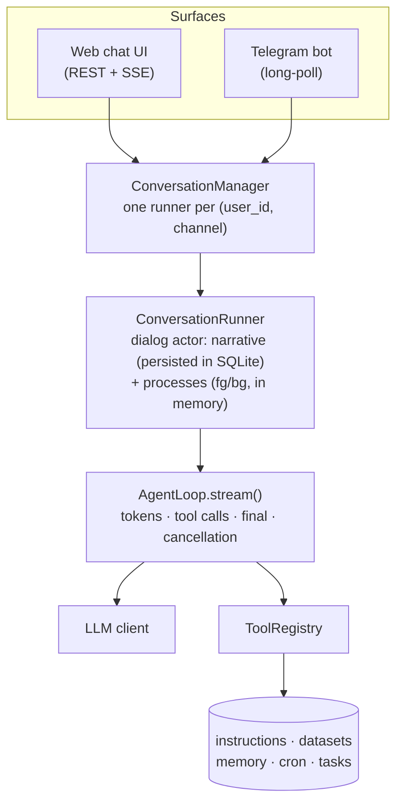

# OctoForge

**A multi-user LLM agent that grows at runtime — no redeploys, no rebuilds.**

[](https://github.com/dmirain/OctoForge/actions/workflows/ci.yml)
[](LICENSE)


Most agent frameworks bake tools and prompts straight into source code: every new capability means a new deploy. OctoForge flips that around — skills, knowledge, HTTP endpoint descriptors, user datasets, and memory all live in the database and are found by embedding search at request time. The agent teaches itself new tricks and remembers what it learns, without anyone touching a line of Python.

## Why

- 🧠 **The agent grows itself.** Knowledge, skills, HTTP tool descriptors, user datasets, and memories are just rows in SQLite (async SQLAlchemy), ranked by embedding similarity plus an optional cross-encoder rerank. The agent saves new instructions on its own — ship it once, let it accumulate capability over time.
- 🔀 **Long jobs don't block the conversation.** Every dialog is an actor with its own foreground/background processes. Work can be pushed to the background with a notification on completion, an LLM router classifies each incoming message (inject into the running process / start a new one / cancel), and a built-in cron scheduler wakes dialogs on a schedule — using the exact same task machinery.
- 🐙 **One core, many surfaces.** A web chat UI and a Telegram bot run on the same conversation engine. The core (`octoforge-core`) never imports FastAPI — it's a plain, typed Python library you can embed anywhere.

## How it works



Every extension point is a `Protocol` port — `LLMClient`, `EmbeddingClient` (local sentence-transformers or an OpenAI-compatible endpoint), `RerankerClient`, `MessageRouter`, `PromptProvider`, `CronStore`/`CronWaker`, `TaskStore`/`TaskSpawner` — wired together in a single composition root. The core never constructs its own dependencies; you assemble the object graph and hand it in.

## Quickstart

Requires Python ≥ 3.11. (Local embeddings need Hugging Face access — models are cached in `~/.cache/huggingface`.)

```bash
make install          # create .venv, install both projects editable with dev deps
cp .env.example .env  # fill in OF_LLM_API_KEY (any OpenAI-compatible endpoint)
make run              # uvicorn with autoreload
```

Open http://127.0.0.1:8000 — a streaming chat UI. The "What's your name?" field sets `user_id` (there's no real auth yet — it's a trusted string).

Telegram bot (optional): set `OF_TELEGRAM_BOT_TOKEN` in `.env` and it starts alongside the web app. Or run it standalone with no HTTP port opened at all — outbound long-polling only:

```bash
make run-telegram
```

For production, run it in containers — `docker compose up -d` starts Postgres plus the Telegram bot, and `docker compose --profile web up -d` adds the web surface on `:8000`. See [docs/deploy.md](docs/deploy.md) for the topology, the one-off SQLite→Postgres data migration (`tools/sqlite_to_postgres.py`) and day-2 operations. Running natively works too: `uvicorn octoforge_web.main:app` without `--reload`, and on SQLite as a single process (exactly one writer). Watch `/health` (liveness) and `/health/ready` (readiness — checks the database).

### Configuration

Full list with comments in [.env.example](.env.example). The essentials:

| Variable | Purpose |
|---|---|
| `OF_LLM_BASE_URL` / `OF_LLM_API_KEY` / `OF_LLM_MODEL` | OpenAI-compatible LLM endpoint (a local Ollama works too) |
| `OF_DATABASE_URL` | async SQLAlchemy URL, defaults to `sqlite+aiosqlite:///./octoforge.db` |
| `OF_EMBEDDING_BACKEND` | `local` (in-process sentence-transformers) or `openai` (HTTP endpoint) |
| `OF_TELEGRAM_BOT_TOKEN` | bot token from @BotFather; empty disables the adapter |
| `OF_SERPER_TOKEN` | web search via serper.dev; empty disables the `web_search` tool |
| `OF_MAX_PROCESSES` / `OF_ROUTER_TIMEOUT_SECONDS` | processes-per-dialog cap / router LLM timeout |
| `OF_SYSTEM_PROMPT_SOURCE` / `OF_ROUTER_PROMPT_SOURCE` | override prompts from files (`file:`, re-read on every turn) |

Without a working embedding backend the app still starts (instruction seeding is skipped), but instruction search/save and dataset search become unavailable.

## What the agent can do out of the box

The built-in tool surface (`ToolRegistry`), wired up in the composition root:

| Tool | Does |
|---|---|
| `http_request` | Arbitrary outbound HTTP call |
| `external_call` | Calls a saved, DB-backed endpoint descriptor, behind an SSRF guard |
| `instruction_search` / `instruction_save` | Finds and saves knowledge, skills, and endpoint descriptors by embedding similarity |
| `data_put` / `data_query` / `data_forget` | User datasets, validated against a JSON schema |
| `memory_store` / `memory_search` / `memory_delete` | Key/value memory, per-user or global |
| `task_create` / `task_list` / `task_delete` | Background work — the same surface also creates cron jobs (just pass a `schedule`) |
| `cron_pause` / `cron_resume` | Control a scheduled job |
| `web_search` | Web search via serper.dev (requires `OF_SERPER_TOKEN`) |

## Using it as a library

`octoforge-core` is a standalone package with no web dependencies (httpx, SQLAlchemy, Alembic, croniter; ships `py.typed`):

```bash
pip install -e core   # from the repo root; no FastAPI required
```

Local embeddings/reranking (`sentence-transformers`, which pulls in torch) are an optional extra, not a hard dependency — skip it if you're only using the OpenAI-compatible backends:

```bash
pip install -e "core[local-embeddings]"
```

Pick your depth of embedding:

- **`AgentLoop`** alone — the bare "LLM ↔ tools" event loop, no database, no dialogs. Needs only an `LLMClient` and a `ToolRegistry`.
- **`ConversationManager`** — full dialogs: SQLite persistence, foreground/background processes, the LLM router, event subscriptions. Example below.
- **The full stack** — add the domain modules (instructions, datasets, memory, cron) and the built-in tools, following the composition root in [`web/src/octoforge_web/main.py`](web/src/octoforge_web/main.py) (the `runtime()` function) — that's the reference wiring for every core dependency.

A minimal, persisted dialog in about 50 lines:

```python
import asyncio

import httpx
from octoforge_core import (
    AgentLoop,
    ConversationManager,
    DialogRepository,
    Failed,
    Finished,
    LLMConfig,
    MessageRepository,
    ToolRegistry,
    SqlAlchemyTaskStore,
    TextDelta,
    create_engine,
    create_session_factory,
    init_db,
)
from octoforge_core.agent.prompts import StaticPromptProvider
from octoforge_core.agent.router import LLMRouter
from octoforge_core.agent.runner import RunnerConfig
from octoforge_core.context.compactor import NoopContextCompactor
from octoforge_core.llm.openai import OpenAICompatibleClient

BASE_URL = "https://api.openai.com/v1"


async def main() -> None:
    engine = create_engine("sqlite+aiosqlite:///./agent.db")
    await init_db(engine)  # in production, use bootstrap_schema(engine) (Alembic) instead
    session_factory = create_session_factory(engine)
    try:
        async with httpx.AsyncClient(base_url=BASE_URL) as http:
            llm = OpenAICompatibleClient(
                http_client=http,
                config=LLMConfig(api_key="sk-...", model="gpt-4o-mini"),
            )
            prompts = StaticPromptProvider()  # built-in prompts; bring your own via the port
            manager = ConversationManager(
                config=RunnerConfig(
                    loop=AgentLoop(llm_client=llm, registry=ToolRegistry(), max_iterations=10),
                    prompts=prompts,
                    router=LLMRouter(llm, timeout_seconds=10.0, prompts=prompts),
                    max_processes=5,
                    compactor=NoopContextCompactor(),  # no history compaction
                ),
                dialogs=DialogRepository(session_factory),
                messages=MessageRepository(session_factory),
                tasks=SqlAlchemyTaskStore(session_factory),
            )

            runner = await manager.get_or_create_runner("user-1", "cli")
            events = runner.subscribe()  # subscribe BEFORE submit, or events get lost
            await runner.submit("Hi! What can you do?")
            while True:
                event = (await events.get()).payload  # subscribe() yields ConversationEvent(dialog_id, seq, payload)
                if isinstance(event, TextDelta):
                    print(event.text, end="", flush=True)
                elif isinstance(event, Finished):
                    break
                elif isinstance(event, Failed):
                    print(f"\nError: {event.error}")
                    break
            await runner.stop()
    finally:
        await engine.dispose()


asyncio.run(main())
```

Notes on the example:

- With an empty `ToolRegistry` the agent answers with text only — tools are registered one at a time (`registry.register(HttpRequestTool(...))`, etc.); see `runtime()` for the full set. Embeddings are only needed by the instruction and dataset tools.
- A dialog survives a restart: the narrative is reloaded from the database on `get_or_create_runner` (processes are in-memory and don't survive).
- The cron scheduler is a separate asyncio loop (`CronScheduler`) on top of `CronStore`; a fire is delivered through the `CronWaker` port (in-process: `ManagerCronWaker(manager)`).

## Development

```bash
make check   # ruff (lint + format) → mypy --strict → pytest, for both projects
```

Individually: `make lint`, `make typecheck`, `make test`, `make format`.

Contributions are welcome — see [CONTRIBUTING.md](CONTRIBUTING.md).

## License

[Business Source License 1.1](LICENSE) © [Dmitry Prokofyev (dmirain)](https://github.com/dmirain)
