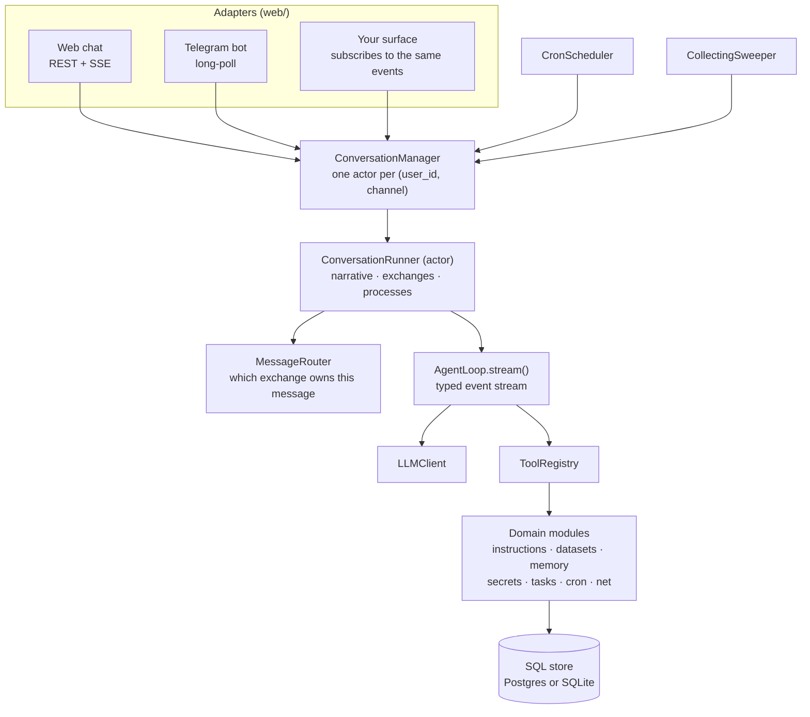

# Architecture

Two Python projects, one dependency rule, and a single place where everything is wired together.

## The two projects

The repository is a monorepo of two independent packages, each with its own `pyproject.toml`,
dependencies and test suite.

**`core/` — `octoforge-core`** (src layout, ships `py.typed`) holds the domain: the agent loop, the
dialog actor, exchanges, instructions, datasets, memories, secrets, tasks, cron, context compaction,
outbound HTTP, and the LLM/embedding/reranker clients. It never imports a web framework. SQLAlchemy
appears only in `db/` (engine, declarative base, migrations) and in the per-module SQL stores.

**`web/` — `octoforge-web`** (src layout) is the adapter layer: a FastAPI application (chat UI, dialog
API, operator console, secret-entry form), a Telegram bot, the settings object, and the default
composition root. It depends on `octoforge-core`.

Nothing depends on `web`. An embedder replaces it.

## The dependency rule

Dependencies point inward. The core defines what it needs as `Protocol` ports and never constructs
its own dependencies; concrete implementations (an HTTP client, a database session factory, a bot
client) are built outside and passed in.

Three consequences worth stating plainly:

- The core is testable without a network or a web server, and its tests substitute fakes for ports
  rather than subclassing concrete classes.
- Any of those implementations can be replaced without touching the core.
- The wiring lives in exactly one place per application, so what an installation *is* can be read off
  a single function.

Module boundaries inside the core are enforced by tests, not convention
(`core/tests/test_boundaries.py`):

- domain modules talk to their neighbours through the neighbour's `api.py` only;
- `tools/` is framework (the `Tool` protocol, the registry, errors) and imports no domain module —
  tool implementations live in their own domain module's `tools.py`;
- `db/` is framework (base, engine, migrations) and imports domain models only for table
  registration;
- `cron/` never imports `agent/` — it knows the `CronWaker` port, which the actor satisfies
  structurally.

`web/tests/test_modularity.py` goes further: it builds a working `ConversationManager` the way a
third-party installer would — from the core builders, with file-based prompts, a fake search provider
and an in-memory instruction store — proving the seams are real without copying the default
composition root.

## The shape of a request

A message goes: transport → `ConversationManager.get_or_create_runner` → the actor's inbox → routing
decision → an exchange → a process running `AgentLoop.stream()` → events broadcast to subscribers →
the transport renders them. Durable state is written on the way through; streaming deltas are not
persisted.

## Layers

| Layer | Where | Contains |
|---|---|---|
| Shared vocabulary | `core/src/octoforge_core/domain.py`, `ports.py`, `errors.py`, `time.py`, `config.py` | `ChatMessage`, `Dialog`, `ToolCall`, enums, the `LLMClient` port, error types, `utc_now()` |
| Framework | `core/src/octoforge_core/tools/`, `db/`, `llm/` | tool protocol and registry, engine and migrations, provider clients |
| Domain modules | `core/src/octoforge_core/agent/`, `dialogs/`, `instructions/`, `datasets/`, `memory/`, `context/`, `tasks/`, `cron/`, `secrets/`, `net/`, `search/`, `vision/`, `speech/`, `admin/` | one concern each, with an `api.py` boundary and a local SQL store |
| Composition | `core/src/octoforge_core/composition.py` | reusable builders over ports and configs, no web dependencies |
| Adapters | `web/src/octoforge_web/` | FastAPI app, Telegram bot, settings, the default composition root in `main.py` |

A domain module is a package with the same internal anatomy: `api.py` (its `Protocol`s, DTOs and
errors — the only thing neighbours import), `models.py` (its ORM rows), `store.py` (the SQL
implementation), `tools.py` (its agent-facing tools), plus whatever service logic it needs.

## Ports

Everything the core needs from the outside world, and what ships as the default implementation:

| Port | Defined in | Default implementation |
|---|---|---|
| `LLMClient` | `ports.py` | `llm/openai.py` (OpenAI-compatible, streaming) wrapped in `llm/retry.py` |
| `EmbeddingClient` | `llm/embeddings.py` | HTTP (`llm/embeddings.py`) or in-process (`llm/local_embeddings.py`) |
| `RerankerClient` | `llm/reranker.py` | local cross-encoder (`llm/reranker.py`) or HTTP (`llm/http_reranker.py`); optional |
| `MessageRouter` | `agent/router.py` | `LLMRouter` — one short tool call, deterministic fallback |
| `PromptProvider` | `agent/prompts.py` | `StaticPromptProvider`; `web/prompts.py` adds file-backed overrides |
| `DialogRepository`, `MessageRepository`, `ExchangeRepository` | `dialogs/api.py` | `dialogs/store.py` |
| `InstructionStore`, `InstructionService`, `InstructionVectorSearch` | `instructions/api.py` | `instructions/store.py`, `instructions/local.py` |
| `DatasetStore`, `DatasetService`, `DatasetVectorSearch` | `datasets/api.py` | `datasets/store.py`, `datasets/service.py` |
| `SummaryStore`, `MessageArchive`, `ContextCompactor` | `context/api.py` | `context/store.py`, `context/compactor.py` |
| `TaskStore` | `tasks/store.py` | `tasks/store.py` (SQL) |
| `TaskSpawner`, `TaskDeleter`, `UserPrompter`, `ImageInspector` | `tools/base.py` | bound implementations on the actor |
| `CronStore`, `CronWaker`, `Scheduler` | `cron/api.py` | `cron/store.py`, `cron/scheduler.py`; the manager satisfies `CronWaker` |
| `SecretStore` | `secrets/api.py` | `secrets/store.py` (Fernet-encrypted rows) |
| `SearchProvider` | `search/api.py` | `search/serper.py`; optional |
| `VisionClient`, `ImageResolver` | `vision/api.py` | `vision/client.py`; the transport resolves image bytes |
| `TranscriptionClient` | `speech/api.py` | `speech/client.py`; optional |
| `AdminReadModel` | `admin/api.py` | `admin/store.py`, read-only |
| `HostResolver` | `net/guard.py` | DNS resolution behind the SSRF guard |
| `TaskOutcomeListener` | `agent/runner.py` | cron outcome reporter from `composition.py` |
| `CollectionPromoter` | `agent/collecting.py` | the conversation manager |

## The composition root

`core/src/octoforge_core/composition.py` holds builder functions — `build_llm_client`,
`build_tool_registry`, `build_agent_loop`, `build_router`, `build_compactor`, `build_runner_config`,
`build_conversation_manager`, `build_instruction_service`, `build_dataset_service`,
`build_external_executor`, `build_cron_scheduler`, `build_collecting_sweeper`,
`build_cron_outcome_reporter`. They take ports and dataclass configs, never a web settings object,
and they are what an alternative composition root reuses.

The HTTP service itself is `web/src/octoforge_web/app.py:build_app()`: the application, its
credential guard, its probes, and the mounting of whatever it is handed. It is given the runtime and
the routes rather than building them, which is what lets an interface be optional — as long as the
thing building the application also knew how to build a bot, a deployment without one meant editing
it. The service is meant to answer the interfaces installed in front of it rather than the open
internet, though it is guarded either way: "internal" is a deployment promise, not a property of the
code.

`web/src/octoforge_web/main.py:runtime()` is the default assembly on top of them: it opens the
database engine, runs migrations, creates the HTTP clients, chooses backends from `Settings`, builds
the registry, starts the cron scheduler and the material sweep, starts the Telegram surface if
configured, and yields a `Runtime` dataclass. Both the FastAPI lifespan and the standalone Telegram
entry point (`python -m octoforge_web.telegram`) use that same function — the surfaces differ, the
graph does not.

Optional capabilities are decided here and nowhere else: an empty setting means the port is `None`
and the feature is absent, which the startup capability report states explicitly
(`web/capabilities.py`).

## Surfaces

Everything a human or a chat talks to — the Telegram bot, the operator console, the browser chat
page — is a *surface*: an optional interface plugged into the service through the `Surface` port
(`web/src/octoforge_web/surfaces.py`).

A surface declares what it adds: a renderer for its channel (`DialogSurface`), tools the agent
gains, and background work to run. Routes and pages are not among them — those mount while the
application is built, before any surface object exists, so each surface module exposes them as
constants the composition root mounts directly.

A surface also names the channel it serves. What the service accepts in `X-Channel` is the union of
those, so a deployment without a bot rejects `telegram` instead of opening a dialog nobody reads —
the set is assembled from what is installed, never written into the service.

The direction of the arrow is the whole point. **The service never imports a surface**, and an
import-boundary test says so (`web/tests/test_surfaces.py`). Only the composition root knows which
ones exist, and `_installed_surfaces()` is the single place that answers it — removing an interface is a matter of not constructing it, not of editing branches
elsewhere. A surface that fails to start or stop is reported and skipped: a broken bot must not cost
the console and the API.

A surface's own pages belong to it, not to the console: the Telegram who-is-who route ships with
Telegram, because Telegram is what can answer it.

## Storage

One relational database, two dialects. Postgres is the deployment target
(`postgresql+asyncpg://`); SQLite is what tests and embedded single-process setups use. All access is
async SQLAlchemy through per-module stores; there is no ORM object handed across a module boundary —
stores map rows to the module's DTOs.

Migrations are a single Alembic chain in `core/src/octoforge_core/db/migrations/`, append-only, and
written dialect-neutrally. The one exception to "one database" is the Telegram invite store, which
has its own base and its own database URL (`OF_TELEGRAM_DATABASE_URL`).

Details: [reference/data-model.md](reference/data-model.md).

## Concurrency model

One asyncio event loop serves every dialog of an installation. Inside it:

- one actor task per dialog, consuming a command inbox, so per-dialog state is never touched
  concurrently;
- one task per process (answer runs and RUN tasks), all streaming at once;
- one cron scheduler task and one material-sweep task per instance;
- the Telegram poller, plus a per-user ingestion queue.

Because it is one loop, a blocking call anywhere freezes every user. The rules that follow from that
— vectorized ranking in a worker thread, chunked conversions, no cross-dialog lock held across an
await, latency-critical commands not queueing behind slow ones — are documented with their measured
cases in [guides/performance.md](guides/performance.md).

Horizontal scale is possible for the parts that are safe: the cron scheduler claims firings with a
SQL compare-and-swap lease, so several instances can run it. Postgres is required for more than one
process, since SQLite allows exactly one writer.

## Code anchors

- `core/src/octoforge_core/composition.py` — the builders
- `core/src/octoforge_core/ports.py`, each module's `api.py` — the ports
- `web/src/octoforge_web/main.py` — `runtime()`, the default composition root
- `core/tests/test_boundaries.py` — the enforced import rules
- `web/tests/test_modularity.py` — a third-party composition root, end to end
