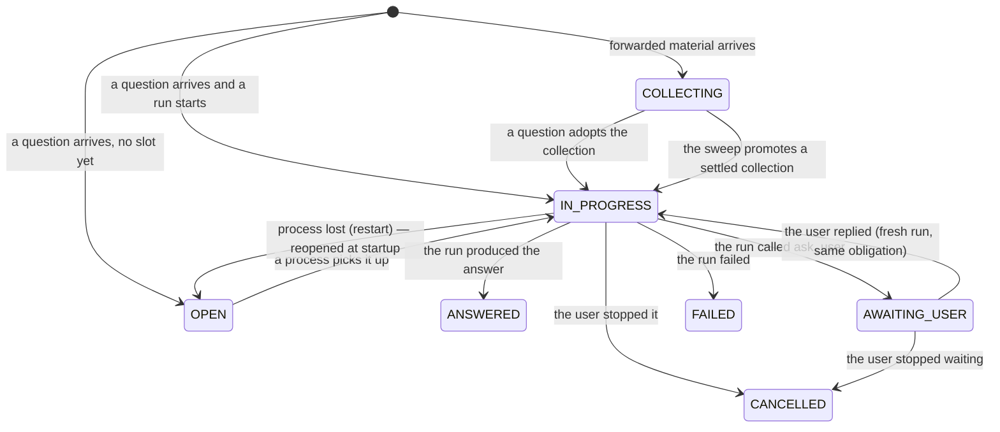

# Exchanges

An exchange is one durable obligation to a user: their question, its clarifications, and the answer
that settles it. It is a row, not a runtime object, which is what makes "what does this installation
still owe people?" a query instead of an inspection of process memory.

## How it works

Every exchange belongs to a dialog and carries a status, a title (derived from the question), the id of
the task that currently owns it, and — when it is waiting — the question it asked the user. Messages
point at their exchange through `messages.exchange_id`.

### Lifecycle

The statuses mean different things about *who owes what*:

| Status | Work belongs to | Notes |
|---|---|---|
| `COLLECTING` | nobody yet | Forwarded material is accumulating; the reaction is deferred |
| `OPEN` | the system | The obligation exists and nobody is serving it — the recovery predicate is `OPEN` with no owner |
| `IN_PROGRESS` | the system | A process owns it and is streaming |
| `AWAITING_USER` | the user | A question went out; nothing must be restarted |
| `ANSWERED` / `CANCELLED` / `FAILED` | nobody | Terminal |

`COLLECTING`, `OPEN`, `IN_PROGRESS` and `AWAITING_USER` are the *live* statuses — the set an incoming
message can be routed into.

### An exchange is not a task

A task is a unit of work with its own status; an exchange is a promise to a person. The two diverge in
both directions:

- a run can finish successfully (task `DONE`) while its exchange stays open, because it asked the user
  something;
- one exchange can be served by several tasks over time — the original run, then the run started by
  the user's reply, then a run resumed after a restart.

See [tasks.md](tasks.md).

### Asking the user something

When a run calls `ask_user`, the actor delivers the question, parks the exchange in `AWAITING_USER`
with `pending_question` recorded, and the run finishes. Everything the run writes after that point is
muted — it already handed the turn back. Nothing is blocked meanwhile: other exchanges keep streaming.

The user's reply is routed back to that exchange (deterministically when the transport knows the reply
target) and starts a fresh run which continues the same obligation.

If the user stays silent, a **nudge** re-asks: an exchange that has been `AWAITING_USER` for longer
than five minutes gets its question repeated, event-driven rather than by a timer, on the next activity
in the dialog. `ask_user` from a RUN task (cron work) returns `False` instead — there is no obligation
to park, and the caller must not promise a reply.

### Forwarded material

Material — a forward, an image with no caption — is not a request. Treating each one as a question
produces an answer per message, which is wrong when someone shares six things in a row.

Material joins the dialog's single `COLLECTING` exchange (created directly in that status, never
briefly `OPEN`, so the recovery sweep cannot mistake it for work to do). From there:

- a real question can **adopt** the collection: routing attaches the batch to the question's exchange,
  and the material becomes context for that answer;
- otherwise the sweep (`CollectingSweeper`) notices the collection has been quiet for
  `OF_MATERIAL_QUIET_SECONDS` and asks the actor to promote it — one reaction for the whole batch.

The sweep is a nominator, not a writer: it finds candidates and the actor re-checks the quiet window
and the status under its own serialization, so promotion cannot race a question that is already
starting a run on the same exchange.

Forwarded text carries no authority. When a promotion re-parents a batch into another live exchange,
any cancellation the router derived from that text is ignored, and the branch marks the content as
somebody else's words.

## Invariants

- **At most one `COLLECTING` exchange per dialog.** Material joins it rather than opening a second one.
- **A collection never exists as `OPEN` and unowned**, not even briefly.
- **`OPEN` with no owner is the definition of pending work** — used by startup recovery and by the
  freed-slot sweep.
- **`IN_PROGRESS` never survives a restart**: an owner recorded in the database is stale by
  definition, so startup resets those to `OPEN`.
- **A run's own exchange is the only obligation it can see.** Other live exchanges' questions are
  removed from its branch entirely.
- **Every event carries its `exchange_id`**, so transports can keep one message per obligation.
- **Live exchanges are capped** by `OF_MAX_PROCESSES`; a message that would exceed the cap is refused
  with a notice rather than dropped.

## Configuration

| Variable | Effect |
|---|---|
| `OF_MAX_PROCESSES` | Maximum live exchanges (and processes) per dialog |
| `OF_MATERIAL_QUIET_SECONDS` | How long a collection may stay quiet before the agent reacts on its own |
| `OF_MATERIAL_SWEEP_INTERVAL_SECONDS` | How often the sweep looks for settled collections |

## Failure modes

| Situation | Outcome |
|---|---|
| Crash while an exchange is `IN_PROGRESS` | Reset to `OPEN` at startup and picked up again |
| Crash while `AWAITING_USER` | Left alone — the user owes the next move; the nudge still applies |
| Limit reached when resuming an `OPEN` exchange | Left for the next freed slot; a user-initiated attempt is told so |
| The run that asked a question is gone and the user stops waiting | `cancel()` closes parked exchanges whose owner is no longer alive, so the nudge stops |
| Material forwarded while a question is being answered | Kept as shared background in other runs' branches; reacted to once its collection settles |

## Code anchors

- `core/src/octoforge_core/dialogs/api.py` — `ExchangeStatus`, `Exchange`, `ExchangeRepository`,
  `LIVE_EXCHANGE_STATUSES`
- `core/src/octoforge_core/dialogs/store.py` — the SQL implementation
- `core/src/octoforge_core/agent/runner.py` — adoption, promotion, `ask_user`, nudges, settlement
- `core/src/octoforge_core/agent/collecting.py` — the material sweep
- `core/src/octoforge_core/dialogs/tools.py` — the `ask_user` tool
- `core/tests/test_collecting_sweeper.py`, `core/tests/test_conversation_runner.py` — behavior
