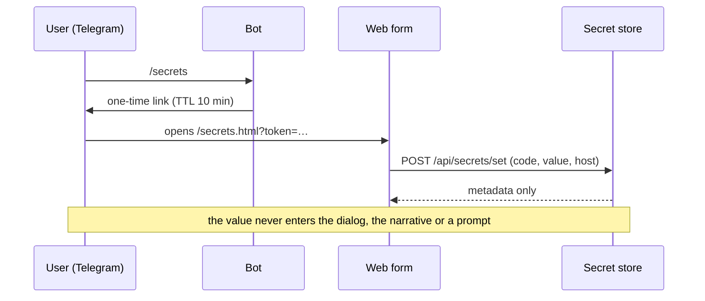

# Secrets

Per-user credentials the agent can *use* but never *see*. A stored endpoint declares which secret it
needs by code; the value is resolved inside the outbound call, bound to one host, and scrubbed from
anything coming back.

## How it works

A secret row holds the user id, a code (`[a-z0-9_]`, up to 64 characters), the encrypted value, the host
it is allowed to be sent to, and timestamps. Encryption is Fernet with the master key from
`OF_SECRETS_KEY`; without that key the whole feature is off and endpoints requiring it fail with an
explicit message.

The DTO exposed by the store (`SecretInfo`) has **no value field**. Every listing surface — the web form,
the operator console, tools — is metadata-only by construction, not by remembering to filter.

`resolve(user_id, code, host)` is the only path a value takes out of the store. It raises if the code is
unknown, and raises if `host` differs from the binding — the error text never contains the value. It also
stamps `last_used_at`.

### How a secret gets in

The value must never appear in a chat, a narrative or a prompt, so it does not travel through the agent
at all:



The token is a capability, valid for ten minutes. It carries its own claim rather than naming a stored
row: the user id encrypted under a key derived from `OF_SECRETS_KEY`, with the expiry stamped inside it.
Nothing about pending links is kept anywhere, so a restart no longer invalidates a link somebody is
about to open — and any process holding the key can both issue and validate one.

That last property is what makes the form work behind a balancer. The form sends no `X-User-Id`; the
token *is* its identity, so nothing can route it back to whichever process issued it, and a token held
in one process's memory would be refused on every other pod. It is also why the Telegram ingestion node
can hand out the link without asking the service for one.

The form and its endpoints are outside the operator's HTTP Basic gate — dialog users have no operator
credential — and are authorized by that token alone.

### How a secret gets used

An endpoint record declares:

```json
{"auth": {"secret": "gmail_token", "header": "Authorization", "format": "Bearer {value}"}}
```

At call time the executor resolves the value for the calling user and the request's host, formats it into
the declared header, sends it, and then scrubs any occurrence of the value from the response before it
reaches the model or the logs.

Two restrictions make this defensible:

- **Headers only.** A secret in a query string would leak into URLs, proxies and access logs.
- **Only from the record's own template.** Substitution never happens in agent-supplied parameter
  values — otherwise a prompt-injected agent could construct a call that ships the secret somewhere else.

And the host binding is the last line: even a poisoned or mistyped endpoint record cannot send a secret
anywhere but the host it was created for.

## Invariants

- **The model only ever sees codes.**
- **The store's DTO carries no value**, so no listing can leak one by accident.
- **A value leaves the store only through `resolve`**, and only for the host it is bound to.
- **Values are scrubbed from responses.**
- **Substitution is header-only and template-only.**
- **An empty `OF_SECRETS_KEY` disables the feature** — endpoints needing it fail loudly rather than
  calling without auth.
- **A malformed master key fails startup**, instead of surfacing later as a confusing per-call error.
- **Link tokens expire on their own**, checked by the pod that redeems them, and are signed with a key
  derived separately from the one that encrypts values — the two uses of `OF_SECRETS_KEY` are kept apart.

## Configuration

| Variable | Effect |
|---|---|
| `OF_SECRETS_KEY` | Fernet master key; empty disables the store |
| `OF_PUBLIC_BASE_URL` | Origin used to build the one-time link (falls back to `OF_SELF_BASE_URL`) |

## Failure modes

| Situation | Outcome |
|---|---|
| Secrets not configured | Endpoints declaring `auth.secret` return "secrets are not configured on this installation" |
| Secret missing for this user | The agent is told to ask the user to run `/secrets` and retry |
| Endpoint host differs from the binding | `SecretHostMismatchError`; nothing is sent |
| Master key lost | Every stored value becomes unreadable; users must re-enter their secrets |
| Link expired | The form says so and tells the user to request a fresh one |
| Response echoes the secret | Scrubbed before the text reaches the context or the log |

## Code anchors

- `core/src/octoforge_core/secrets/api.py` — `SecretStore`, `SecretInfo`, code/host normalization, errors
- `core/src/octoforge_core/secrets/store.py` — the Fernet-encrypted SQL store
- `core/src/octoforge_core/net/external.py` — resolution, header injection, scrubbing
- `core/src/octoforge_core/net/tool_spec.py` — the `auth.secret` declaration
- `server/src/octoforge_server/secret_links.py` — one-time tokens
- `server/src/octoforge_server/api/secrets.py`, `server/src/octoforge_server/static/secrets.html` — the form and its API
- `core/tests/test_secrets_store.py`, `deploy/tests/test_secrets_api.py`
