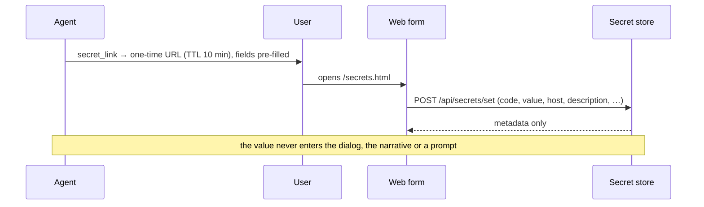

# Secrets

Per-user credentials the agent can *use* but never *see*. A stored endpoint references a secret by
code in its templates (`{secret.code}`); the value is resolved inside the outbound call, bound to one
host, transformed if the secret says so, and scrubbed from anything coming back.

## How it works

A secret row holds the user id, a code (`[a-z0-9_]`, up to 64 characters), the encrypted value, the
host it is allowed to be sent to, a **required description** (what the secret is for — it is how the
model tells two secrets for one host apart), the request parts it may be substituted into
(`placements`), an optional static `transform`, and timestamps. Encryption is Fernet with the master
key from `OF_SECRETS_KEY`; without that key the whole feature is off and endpoints requiring it fail
with an explicit message.

The DTO exposed by the store (`SecretInfo`) has **no value field**. Every listing surface — the web
form, the operator console, tools — is metadata-only by construction, not by remembering to filter.

`resolve(user_id, code, host)` is the only path a value takes out of the store. It raises if the code
is unknown, and raises if `host` differs from the binding — the error text never contains the value.
It also stamps `last_used_at`. What it returns (`ResolvedSecret`) carries the value with the
transform already applied, the stored plain value (only so scrubbing can mask both forms), and the
allowed placements the executor enforces.

### Placements

Where a template may put the secret. The default — and the only default — is `header`; `url` and
`body` are opt-in per secret, chosen by the person who stores it. A secret in a query string travels
into the remote side's access logs, which is why it takes an explicit decision; some APIs simply
accept nothing else (`?api_key=…`). Wherever it lands, a secret can never form the URL scheme or
host — the parser rejects such templates outright, because the host is what the SSRF guard and the
host binding judge.

### Transforms

A static function applied to the stored value before substitution, chosen when the secret is stored:
`base64`, `base64url`, `md5_hex`, `sha1_hex`, `sha256_hex`. The canonical case is HTTP Basic — store
`user:password`, set `transform: base64`, and let the record write `"Authorization": "Basic
{secret.code}"`. Every transform is a pure function of the value alone; anything needing per-request
inputs (timestamps, nonces, request signing, OAuth refresh) is deliberately out of scope — that is
protocol code, not a value filter.

### How a secret gets in

The value must never appear in a chat, a narrative or a prompt, so it does not travel through the
agent at all. The agent's own path is `secret_link`: the tool mints a one-time form URL with every
field but the value pre-filled — code and host from the failing endpoint, a description the agent
writes, placements and transform when needed. The user opens the link and pastes only the value.



The manual fallback is `/secrets` in Telegram, which mints the same kind of link with an empty form.

The token is a capability, valid for ten minutes. It carries its own claim rather than naming a
stored row, encrypted under a key derived from `OF_SECRETS_KEY`, with the expiry stamped inside it.
Nothing about pending links is kept anywhere, so a restart no longer invalidates a link somebody is
about to open, and any process holding the key can issue one. There are two claim shapes:

- **An account** — surface and external id — for links minted by a surface (`/secrets` in Telegram).
  Whoever hands out that link may not know who the account belongs to — the Telegram ingestion node
  has only its own invite database — so the service resolves account → person on arrival, the same
  resolution `X-User-Id` gets. Naming the person in the link instead once put the form in a different
  namespace from the agent: secrets were written under `tg:<account>` and read back under the person,
  so everything saved after the identity migration was invisible with no error at the point of
  writing. Resolution is `resolve_or_create`, because `/secrets` is intercepted before the dialog
  pipeline: for somebody whose first message is that command, the person does not exist yet.
- **A person**, for links minted by the agent's `secret_link` tool — that code runs inside the
  service and already knows the person, so the token names the user id directly and carries the
  pre-filled fields (never the value).

That self-contained claim is what makes the form work behind a balancer. The form sends no
`X-User-Id`; the token *is* its identity, so nothing can route it back to whichever process issued
it, and a token held in one process's memory would be refused on every other pod. It is also why the
Telegram ingestion node can hand out the link without asking the service for one.

The form and its endpoints are outside the operator's HTTP Basic gate — dialog users have no operator
credential — and are authorized by that token alone.

### How a secret gets used

An endpoint record references it from any of its templates (see
[endpoints-and-net.md](endpoints-and-net.md) for the full template language):

```json
{"headers": {"Authorization": "Basic {secret.gmail_token}"},
 "url_template": "https://api.example.com/v1/data?api_key={secret.query_key}"}
```

The legacy `auth` object is sugar for the one-header case and expands to exactly such a header
template:

```json
{"auth": {"secret": "gmail_token", "header": "Authorization", "format": "Bearer {value}"}}
```

At call time the executor resolves each referenced value for the calling user and the request's
host — *after* the URL has been rendered from model and user params and checked, so a secret never
influences where the request goes — applies the transform, substitutes into the parts the placements
allow, sends, and then scrubs any occurrence of the value (sent or plain form) from the response
before it reaches the model or the logs.

Two restrictions make this defensible:

- **Only where the placements allow**, headers by default; and never into the URL host.
- **Only from the record's own templates.** Substitution never happens in agent-supplied parameter
  values — otherwise a prompt-injected agent could construct a call that ships the secret somewhere
  else.

And the host binding is the last line: even a poisoned or mistyped endpoint record cannot send a
secret anywhere but the host it was created for.

### What the agent can do

Two tools, neither of which ever touches a value:

| Tool | Purpose |
|---|---|
| `secret_list` | The caller's secrets: code, host, description, placements, transform, last used. How the model picks the right code — a backfilled placeholder description reads as its own "ask the user" instruction |
| `secret_link(code, host, description, placements?, transform?)` | Mint the pre-filled one-time form URL described above |

A missing secret tells the agent exactly this: the failing call's message names the code and the
host and instructs the model to mint a `secret_link` with a meaningful description.

## Invariants

- **The model only ever sees codes and metadata** — descriptions included, values never.
- **The store's DTO carries no value**, so no listing can leak one by accident.
- **A value leaves the store only through `resolve`**, and only for the host it is bound to.
- **A description is required** — by the store on every write and by the schema (`NOT NULL`); rows
  from before the requirement were backfilled by migration with a placeholder that itself tells the
  agent to ask the user and update it.
- **Secrets are substituted only into the parts their placements allow** (headers unless opted
  otherwise), only from the record's templates, and never into the URL scheme or host.
- **Values are scrubbed from responses in both forms** — as sent (post-transform) and as stored — so
  an API that inverts the transform cannot echo the plain value into the context.
- **An empty `OF_SECRETS_KEY` disables the feature** — endpoints needing it fail loudly rather than
  calling without auth.
- **A malformed master key fails startup**, instead of surfacing later as a confusing per-call error.
- **Link tokens expire on their own**, checked by the pod that redeems them, and are signed with a key
  derived separately from the one that encrypts values — the two uses of `OF_SECRETS_KEY` are kept apart.

## Configuration

| Variable | Effect |
|---|---|
| `OF_SECRETS_KEY` | Fernet master key; empty disables the store |
| `OF_PUBLIC_BASE_URL` | Origin used to build the one-time link (falls back to `OF_SELF_BASE_URL`) |

## Failure modes

| Situation | Outcome |
|---|---|
| Secrets not configured | Endpoints referencing `{secret.*}` return "secrets are not configured on this installation" |
| Secret missing for this user | The agent is told the code and host and to mint a pre-filled `secret_link` (or fall back to `/secrets`) |
| Endpoint host differs from the binding | `SecretHostMismatchError`; nothing is sent |
| Template puts the secret where placements forbid | The call fails naming the part and the allowed placements; nothing is sent |
| Stored transform unknown to this version | The call fails loudly — substituting the raw value where a hash was promised would *send* the plain secret |
| Master key lost | Every stored value becomes unreadable; users must re-enter their secrets |
| Link expired | The form says so and tells the user to request a fresh one |
| Response echoes the secret | Scrubbed before the text reaches the context or the log |

## Code anchors

- `core/src/octoforge_core/secrets/api.py` — `SecretStore`, `SecretInfo`, `ResolvedSecret`,
  placements, transforms, normalization, errors
- `core/src/octoforge_core/secrets/store.py` — the Fernet-encrypted SQL store
- `core/src/octoforge_core/secrets/tools.py` — `secret_list`, `secret_link`
- `core/src/octoforge_core/net/external.py` — resolution, placement enforcement, substitution, scrubbing
- `core/src/octoforge_core/net/tool_spec.py` — the `{secret.*}` namespace and the `auth` sugar
- `server/src/octoforge_server/secret_links.py` — one-time tokens (account and person claims, prefill)
- `server/src/octoforge_server/api/secrets.py`, `server/src/octoforge_server/static/secrets.html` — the form and its API
- `core/tests/test_secrets_store.py`, `core/tests/test_secret_tools.py`, `deploy/tests/test_secrets_api.py`
